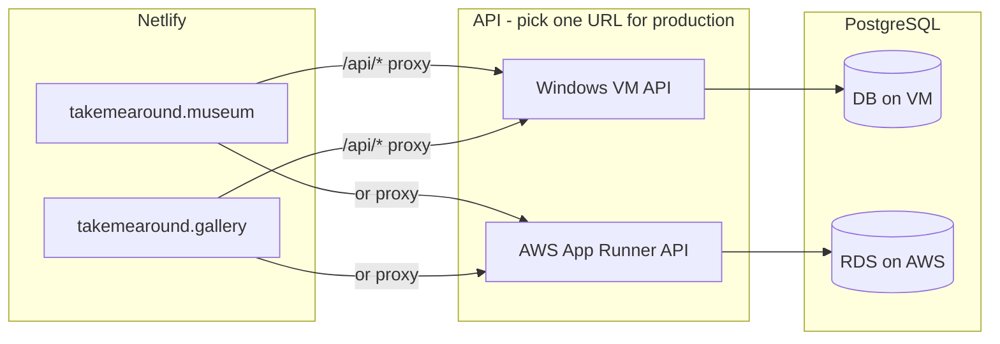

# Full deployment guide — Windows VM + AWS + Netlify

This walks you from **empty VM** to a **running API** on both your **Windows server** and **AWS**, with **Netlify** frontends talking to the API.

## Big picture



| What | Where it lives |
|------|----------------|
| Museum & Gallery websites | **Netlify** (already) |
| Flask API (`app.py`) | **Windows VM** and/or **AWS App Runner** |
| Database `poise_log` | **On the VM** and/or **Amazon RDS** |
| Your Mac | **Development only** (`./run`, optional ngrok) |

**Production tip:** Netlify should proxy to **one** API URL (VM **or** AWS). You can run **both** for staging vs production:

| Environment | Netlify branch / site | `VITE_API_PROXY_TARGET` |
|-------------|------------------------|-------------------------|
| Staging | deploy preview or test site | VM tunnel URL |
| Production | museum + gallery | AWS App Runner URL |

---

## Before you start (checklist)

- [ ] **Git** repo pushed (e.g. `github.com/florentgiovannone/TMA_BE`)
- [ ] **AWS account** + AWS CLI installed on your Mac (`aws configure`)
- [ ] **Windows VM** with RDP access, internet outbound
- [ ] **Netlify** access to museum + gallery sites
- [ ] Know your **`poise_log`** table (or use sample SQL below)

---

## Part 0 — Get the code on your machines

### On your Mac (for AWS push)

```bash
cd ~/Desktop/development/a_bet_a/takemearound/Backend
git pull
```

### On the Windows VM

```powershell
# Install Git for Windows if needed: https://git-scm.com
cd C:\
git clone git@github.com:florentgiovannone/TMA_BE.git Backend
cd Backend
```

(Use HTTPS clone URL if you don’t use SSH keys on the VM.)

---

## Part 1 — Database

You need PostgreSQL with a **`poise_log`** table. Choose **one** primary database (you can duplicate data later; start simple).

### Option A — Postgres on the Windows VM

1. Install **PostgreSQL for Windows**: https://www.postgresql.org/download/windows/
2. Remember the superuser password you set during install.
3. Create database and user (pgAdmin or `psql`):

```sql
CREATE USER poise WITH PASSWORD 'your-db-password';
CREATE DATABASE aba_cards OWNER poise;
\c aba_cards
-- Adjust columns to match your real table; minimum the API expects:
CREATE TABLE IF NOT EXISTS poise_log (
  int_id SERIAL PRIMARY KEY,
  dtm_timestamp TIMESTAMPTZ,
  txt_message_type TEXT,
  txt_message TEXT,
  text_name TEXT
);
GRANT ALL ON poise_log TO poise;
GRANT USAGE, SELECT ON ALL SEQUENCES IN SCHEMA public TO poise;
```

4. VM API `.env` will use:

```env
PGHOST=localhost
PGPORT=5432
PGDATABASE=aba_cards
PGUSER=poise
PGPASSWORD=your-db-password
```

### Option B — Postgres on AWS RDS

1. **AWS Console → RDS → Create database**
   - Engine: **PostgreSQL**
   - Template: **Free tier** or Dev/Test
   - DB identifier: e.g. `tma-poise`
   - Master username / password: note them
   - Database name: `aba_cards`
   - **Public access**: Yes (simplest for first setup) *or* No + VPC connector on App Runner
2. Security group → **Inbound**: PostgreSQL **5432** from:
   - App Runner VPC connector security group, **or**
   - Your IP (testing only)
3. Run the same `CREATE TABLE poise_log` SQL in RDS (Query Editor or `psql`).
4. AWS API env:

```env
PGHOST=tma-poise.xxxxx.eu-west-1.rds.amazonaws.com
PGPORT=5432
PGDATABASE=aba_cards
PGUSER=poise
PGPASSWORD=...
```

### Option C — Two databases (VM + AWS)

Use **VM Postgres** for the VM API and **RDS** for the AWS API. Import/migrate data between them if they must show the same logs (pg_dump / pg_restore). For a first deploy, one DB is enough.

---

## Part 2 — Deploy API on the Windows VM

### 2.1 Install prerequisites on the VM

- **Python 3.12**: https://www.python.org/downloads/windows/ (check “Add to PATH”)
- **OR Docker Desktop**: https://www.docker.com/products/docker-desktop/

### 2.2 Configure environment

```powershell
cd C:\Backend
copy .env.example .env
notepad .env
```

Set at least:

```env
PGHOST=localhost
PGPORT=5432
PGDATABASE=aba_cards
PGUSER=poise
PGPASSWORD=your-db-password
DASHBOARD_PASSWORD=choose-a-strong-password
DASHBOARD_PASSWORD_ARKIN=rodin-dashboard
```

(`DASHBOARD_PASSWORD_ARKIN` is required for the Arkın Rodin dashboard; it sends `X-Dashboard-App: arkin`.)

### 2.3 Run the API

**Path A — Docker (matches AWS image):**

```powershell
docker build -t tma-be-api .
docker run -d --name tma-api --restart unless-stopped -p 5050:8080 --env-file .env tma-be-api
```

**Path B — Python / waitress:**

```powershell
Set-ExecutionPolicy -Scope CurrentUser RemoteSigned
.\deploy\windows\run-api.ps1
```

### 2.4 Test on the VM

```powershell
curl http://localhost:5050/api/health
curl -H "X-Dashboard-Password: choose-a-strong-password" http://localhost:5050/api/items
curl -H "X-Dashboard-App: arkin" -H "X-Dashboard-Password: rodin-dashboard" http://localhost:5050/api/secure/items
```

### 2.5 Expose the VM to the internet (for Netlify)

Pick **one**:

**A. ngrok on the VM** (quickest)

1. Install ngrok: https://ngrok.com/download
2. `ngrok config add-authtoken YOUR_TOKEN`
3. `ngrok http 5050`
4. Copy `https://xxxx.ngrok-free.app` → this is **VM_API_URL**

**B. Cloudflare Tunnel** (stable free HTTPS)

1. Install `cloudflared`, create a tunnel to `http://localhost:5050`
2. Copy the public URL → **VM_API_URL**

**C. Public IP + domain + Caddy/IIS** (production-grade on VM)

Point `api.yourdomain.com` to the VM and terminate TLS there.

### 2.6 Windows Firewall

Allow inbound **TCP 5050** only if you expose the port directly. With ngrok/Cloudflare, you often **don’t** need to open 5050 to the world.

**Write down:** `VM_API_URL = https://....`

---

## Part 3 — Deploy API on AWS

Do this from your **Mac** (or any machine with Docker + AWS CLI).

### 3.1 One-time AWS setup

```bash
aws configure
# Region: e.g. eu-west-1
```

### 3.2 Create RDS (if you didn’t in Part 1B)

Follow **Part 1 — Option B**. Note the endpoint.

### 3.3 Push Docker image to ECR

```bash
cd Backend
chmod +x deploy/aws/push-ecr.sh
export AWS_REGION=eu-west-1
./deploy/aws/push-ecr.sh
```

Save the printed URI, e.g. `123456789012.dkr.ecr.eu-west-1.amazonaws.com/tma-be-api:latest`.

### 3.4 Create App Runner service

1. **AWS Console → App Runner → Create service**
2. **Repository type**: Amazon ECR → select `tma-be-api` → tag `latest`
3. **ECR access role**: create if prompted
4. **Service settings**
   - Port: **8080**
   - CPU/Memory: 1 vCPU / 2 GB (default is fine to start)
5. **Environment variables** (same names as `.env.example`):

   | Key | Value |
   |-----|--------|
   | `PGHOST` | RDS endpoint |
   | `PGPORT` | `5432` |
   | `PGDATABASE` | `aba_cards` |
   | `PGUSER` | `poise` |
   | `PGPASSWORD` | RDS password |
   | `DASHBOARD_PASSWORD` | strong password (can match VM or differ) |

6. **Health check**: HTTP, path `/api/health`
7. **Networking** (if RDS is **not** public):
   - Create **VPC connector** in the same VPC/subnets as RDS
   - Attach connector to this service
   - RDS security group: allow 5432 from connector SG
8. **Create & deploy** — wait until status **Running**

### 3.5 Test AWS

```bash
export AWS_URL=https://xxxxx.eu-west-1.awsapprunner.com
curl -sS "$AWS_URL/api/health"
curl -sS -H "X-Dashboard-Password: YOUR_PASSWORD" "$AWS_URL/api/items"
```

**Write down:** `AWS_API_URL = https://xxxxx.awsapprunner.com`

---

## Part 4 — Connect Netlify (museum + gallery)

Do this **per site** (museum and gallery are separate Netlify projects).

1. **Netlify → Site → Site configuration → Environment variables**
2. Add (scopes: **Build**):

   | Variable | Value |
   |----------|--------|
   | `VITE_API_PROXY_TARGET` | `AWS_API_URL` for production **or** `VM_API_URL` for staging |
   | `VITE_DASHBOARD_PASSWORD` | same as `DASHBOARD_PASSWORD` on that API |

3. **Remove** or leave empty `VITE_API_BASE_URL` (avoid direct cross-origin to ngrok/AWS in the browser).
4. **Deploys → Trigger deploy → Deploy site**
5. After deploy, open **Deploy file browser** → `dist/_redirects` should contain:

   ```text
   /api/*  https://YOUR-API-URL/api/:splat  200
   /*    /index.html   200
   ```

6. Test dashboard on live site: enter password → data loads.

---

## Part 5 — Verify end-to-end

| Step | VM | AWS |
|------|----|-----|
| Health | `curl VM_API_URL/api/health` | `curl AWS_API_URL/api/health` |
| Auth | `curl -H "X-Dashboard-Password: …" …/api/items` | same |
| Netlify | Set proxy to VM URL, redeploy, test dashboard | Set proxy to AWS URL, redeploy, test |

---

## Part 6 — Day-to-day operations

| Task | VM | AWS |
|------|----|-----|
| Update API code | `git pull`, rebuild Docker / restart `run-api.ps1` | `./deploy/aws/push-ecr.sh`, App Runner **Deploy** new image |
| Logs | `docker logs tma-api` | App Runner → **Logs** |
| Stop costs | Stop VM or stop container | Pause / delete App Runner + RDS |
| Local dev on Mac | `./run` | — |

---

## Troubleshooting

| Symptom | Fix |
|---------|-----|
| Netlify: “HTML instead of API” | `VITE_API_PROXY_TARGET` missing at **build** time → redeploy |
| CORS errors to ngrok/AWS URL | Use **proxy** (`VITE_API_PROXY_TARGET`), not `VITE_API_BASE_URL` on live sites |
| `[]` + empty dashboard | DB connection failed; check `X-DB-Error` response header; fix `PGHOST` / firewall |
| App Runner unhealthy | Port must be **8080**; health path `/api/health` |
| VM can’t reach RDS | Open RDS SG to VM **public IP** on 5432 (or use DB only on VM) |

---

## Quick reference — env vars

| Variable | Used by |
|----------|---------|
| `PGHOST`, `PGPORT`, `PGDATABASE`, `PGUSER`, `PGPASSWORD` | Flask on VM & AWS |
| `DASHBOARD_PASSWORD` | Flask API auth |
| `VITE_API_PROXY_TARGET` | Netlify build → `_redirects` |
| `VITE_DASHBOARD_PASSWORD` | Frontend dashboard UI |

---

## Suggested first-time order

1. **Part 1A** — Postgres on VM + sample table  
2. **Part 2** — API on VM + ngrok → test with curl  
3. **Part 4** — Netlify → `VITE_API_PROXY_TARGET` = ngrok URL → test dashboard  
4. **Part 1B + 3** — RDS + App Runner on AWS  
5. **Part 4** — switch production Netlify to **AWS_API_URL**

When both work, you have **VM (staging)** and **AWS (production)** with the same codebase.
